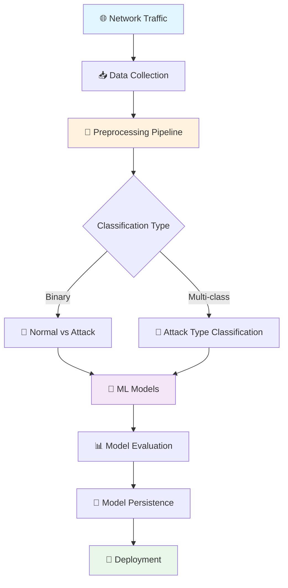
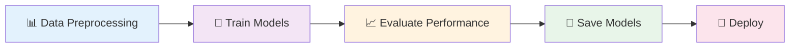

<div align="center">

# 🛡️ Network Intrusion Detection Using Machine Learning


[](https://www.python.org/)
[](https://www.tensorflow.org/)
[](https://keras.io/)
[](https://scikit-learn.org/)
[](https://jupyter.org/)
[](https://numpy.org/)
[](https://pandas.pydata.org/)


### 🔐 Intelligent Defense Against Cyber Threats | 🤖 Powered by Deep Learning & AI

[Features](#-features) • [Architecture](#-architecture) • [Models](#-models) • [Installation](#-installation) • [Usage](#-usage) • [Results](#-results)

[](https://github.com/AndrousStark/network-intrusion-detection-using-machine-learning/stargazers)
[](https://github.com/AndrousStark/network-intrusion-detection-using-machine-learning/network/members)
[](https://github.com/AndrousStark/network-intrusion-detection-using-machine-learning/issues)
[](https://opensource.org/licenses/MIT)

</div>

---

## 📑 Table of Contents

- [🎯 Overview](#-overview)
- [✨ Features](#-features)
- [🏗️ Architecture](#️-architecture)
- [🤖 Machine Learning Models](#-machine-learning-models)
- [📊 Dataset](#-dataset)
- [🚀 Installation](#-installation)
- [💻 Usage](#-usage)
- [📈 Results & Performance](#-results--performance)
- [🔬 Research Foundation](#-research-foundation)
- [🛠️ Tech Stack](#️-tech-stack)
- [📁 Project Structure](#-project-structure)
- [🎓 Learning Outcomes](#-learning-outcomes)
- [🤝 Contributing](#-contributing)
- [👨‍💻 Author](#-author)
- [📄 License](#-license)

---

## 🎯 Overview

<div align="center">

</div>

**Network Intrusion Detection Using Machine Learning** is a cutting-edge cybersecurity project that leverages the power of artificial intelligence to identify and classify network intrusions with unprecedented accuracy. This comprehensive system implements **8 state-of-the-art machine learning algorithms** across **dual classification tasks** to create a robust defense against cyber threats.

### 🌟 Key Highlights

```diff
+ 8 Machine Learning Models (Traditional ML + Deep Learning)
+ 2 Classification Tasks (Binary + Multi-class)
+ NSL-KDD Dataset (Industry-Standard Benchmark)
+ Pre-trained Models Ready for Deployment
+ Comprehensive Performance Visualization
+ Research-Backed Implementation
```

---

## ✨ Features

<table>
<tr>
<td width="50%">

### 🧠 **Deep Learning Models**
- 🔹 **Autoencoder** - Unsupervised feature learning
- 🔹 **LSTM** - Sequential pattern recognition
- 🔹 **MLP** - Deep neural network classification

</td>
<td width="50%">

### 📊 **Traditional ML Models**
- 🔹 **K-Nearest Neighbors** - Instance-based learning
- 🔹 **Linear/Quadratic SVM** - Support vector machines
- 🔹 **LDA/QDA** - Discriminant analysis

</td>
</tr>
</table>

### 🎯 **Dual Classification Approach**

<div align="center">

| Classification Type | Description | Use Case |
|:-------------------:|:------------|:---------|
| 🔴 **Binary** | Normal vs. Attack | Real-time threat detection |
| 🌈 **Multi-class** | Specific attack categorization | Forensic analysis & response |

</div>

### 🚀 **Production-Ready Features**

- ✅ **Pre-trained Models** - Saved and ready for deployment
- ✅ **Comprehensive Visualization** - Accuracy, loss, and distribution plots
- ✅ **Modular Architecture** - Easy to extend and customize
- ✅ **Well-Documented Code** - Clear notebooks with explanations
- ✅ **Performance Metrics** - Detailed evaluation of all models
- ✅ **Scalable Pipeline** - From preprocessing to deployment

---

## 🏗️ Architecture

<div align="center">



</div>

### 🔄 **Workflow Pipeline**

1. **Data Preprocessing** 📊
   - Feature extraction and selection
   - Normalization and scaling
   - Label encoding for classification

2. **Model Training** 🎯
   - Binary classification (Normal/Attack)
   - Multi-class classification (Attack types)
   - Hyperparameter optimization

3. **Evaluation & Validation** ✅
   - Accuracy metrics
   - Loss analysis
   - Confusion matrices

4. **Model Persistence** 💾
   - Save trained models (JSON/Pickle/H5)
   - Export weights and configurations
   - Version control

---

## 🤖 Machine Learning Models

<div align="center">

### 🧠 Deep Learning Arsenal

</div>

<table>
<tr>
<td align="center" width="33%">

<h3>🔮 Autoencoder</h3>
<p><b>Unsupervised Learning</b></p>
<p>Feature extraction and dimensionality reduction</p>

</td>
<td align="center" width="33%">

<h3>🔄 LSTM</h3>
<p><b>Recurrent Neural Network</b></p>
<p>Sequential pattern recognition</p>

</td>
<td align="center" width="33%">

<h3>🧬 MLP</h3>
<p><b>Multi-Layer Perceptron</b></p>
<p>Deep feedforward network</p>

</td>
</tr>
</table>

<div align="center">

### 📊 Traditional Machine Learning

</div>

<table>
<tr>
<td align="center" width="25%">

<h4>📍 K-NN</h4>
<p>Distance-based classification</p>
</td>
<td align="center" width="25%">

<h4>🔷 Linear SVM</h4>
<p>Linear decision boundary</p>
</td>
<td align="center" width="25%">

<h4>🔶 Quadratic SVM</h4>
<p>Non-linear separation</p>
</td>
<td align="center" width="25%">

<h4>📐 LDA/QDA</h4>
<p>Discriminant analysis</p>
</td>
</tr>
</table>

### 🎯 Model Comparison

| Model | Type | Best For | Complexity |
|:------|:-----|:---------|:-----------|
| **Autoencoder** | Deep Learning | Feature learning, anomaly detection | ⭐⭐⭐⭐⭐ |
| **LSTM** | Deep Learning | Sequential patterns, time-series | ⭐⭐⭐⭐⭐ |
| **MLP** | Deep Learning | Complex non-linear patterns | ⭐⭐⭐⭐ |
| **K-NN** | Traditional ML | Instance-based learning | ⭐⭐ |
| **Linear SVM** | Traditional ML | Linear separable data | ⭐⭐⭐ |
| **Quadratic SVM** | Traditional ML | Non-linear patterns | ⭐⭐⭐⭐ |
| **LDA** | Traditional ML | Dimensionality reduction | ⭐⭐ |
| **QDA** | Traditional ML | Non-linear boundaries | ⭐⭐⭐ |

---

## 📊 Dataset

<div align="center">

### 🗂️ NSL-KDD Dataset


</div>

The **NSL-KDD dataset** is an improved version of the original KDD Cup 1999 dataset, specifically designed for network intrusion detection research. It addresses key issues present in the legacy dataset.

### 📁 Dataset Files

```
📦 Datasets/
├── 📄 bin_data.csv        # Binary classification dataset
├── 📄 multi_data.csv      # Multi-class classification dataset
└── 📄 KDDTrain+.txt       # Original NSL-KDD training data
```

### 🏷️ Labels

```
📦 Labels/
├── 🏷️ le1_classes.npy    # Binary labels (Normal/Attack)
└── 🏷️ le2_classes.npy    # Multi-class labels (Attack types)
```

### 📈 Dataset Characteristics

| Feature | Value |
|:--------|:------|
| **Instances** | 125,973 training records |
| **Features** | 41 network traffic features |
| **Attack Types** | DoS, Probe, R2L, U2R + Normal |
| **Balance** | Improved distribution vs KDD99 |

### 🎯 Attack Categories

<div align="center">

| Category | Description | Examples |
|:---------|:------------|:---------|
| 🔴 **DoS** | Denial of Service | Teardrop, Smurf, Pod |
| 🔍 **Probe** | Surveillance & Probing | Port Scan, IP Sweep |
| 🚪 **R2L** | Remote to Local | Password Guessing, FTP Write |
| 👑 **U2R** | User to Root | Buffer Overflow, Rootkit |

</div>

---

## 🚀 Installation

### 📋 Prerequisites

<div align="center">


</div>

### ⚡ Quick Start

```bash
# Clone the repository
git clone https://github.com/AndrousStark/network-intrusion-detection-using-machine-learning.git

# Navigate to directory
cd network-intrusion-detection-using-machine-learning

# Install dependencies
pip install -r requirements.txt
```

### 📦 Required Libraries

```python
# Core Libraries
tensorflow>=2.0.0
keras>=2.4.0
scikit-learn>=0.24.0
numpy>=1.19.0
pandas>=1.2.0
matplotlib>=3.3.0
seaborn>=0.11.0

# Utilities
pickle5
h5py
```

### 🔧 Manual Installation

```bash
pip install tensorflow keras scikit-learn numpy pandas matplotlib seaborn
```

---

## 💻 Usage

### 🎯 Running the Notebooks

<table>
<tr>
<td width="50%">

#### 📓 **Option 1: Jupyter Notebook**

```bash
# Launch Jupyter
jupyter notebook

# Open notebooks:
# - Data_Preprocessing_NSL-KDD.ipynb
# - Classifiers_NSL-KDD.ipynb
# - Intrusion_Detection.ipynb
```

</td>
<td width="50%">

#### ☁️ **Option 2: Google Colab**

1. Upload notebooks to Google Drive
2. Open with Google Colaboratory
3. Upload dataset files
4. Run cells sequentially

</td>
</tr>
</table>

### 🔄 Workflow Steps



### 1️⃣ **Data Preprocessing**

```python
# Run Data_Preprocessing_NSL-KDD.ipynb
# - Load NSL-KDD dataset
# - Feature engineering
# - Normalization
# - Train-test split
```

### 2️⃣ **Model Training**

```python
# Run Classifiers_NSL-KDD.ipynb
# - Train all 8 models
# - Binary classification
# - Multi-class classification
# - Save trained models
```

### 3️⃣ **Complete Pipeline**

```python
# Run Intrusion_Detection.ipynb
# - End-to-end workflow
# - Preprocessing + Training
# - Evaluation + Visualization
```

### ⌨️ Keyboard Shortcuts

| Action | Shortcut |
|:-------|:---------|
| Run entire notebook | `Ctrl + F9` |
| Run selected cell | `Shift + Enter` |
| Run cell and insert below | `Ctrl + Shift + Enter` |

### ⚠️ Important Notes

> **⚡ Execution Order Matters!**
> 
> Run cells sequentially from top to bottom for best results.

---

## 📈 Results & Performance

<div align="center">

### 🏆 Model Performance Dashboard

</div>

### 📊 Visual Analytics

The project generates comprehensive visualizations:

<table>
<tr>
<td align="center" width="50%">
<h4>📈 Training Metrics</h4>
<ul align="left">
<li>✅ Accuracy curves</li>
<li>✅ Loss curves</li>
<li>✅ Validation metrics</li>
</ul>
</td>
<td align="center" width="50%">
<h4>📉 Model Analysis</h4>
<ul align="left">
<li>✅ Confusion matrices</li>
<li>✅ ROC curves</li>
<li>✅ Class distributions</li>
</ul>
</td>
</tr>
</table>

### 📁 Generated Plots

```
📦 Plots/
├── 🥧 Pie_chart_binary.png       # Binary class distribution
├── 🥧 Pie_chart_multi.png        # Multi-class distribution
├── 📊 ae_binary_accuracy.png     # Autoencoder accuracy
├── 📊 ae_binary_loss.png         # Autoencoder loss
├── 📊 lstm_binary_accuracy.png   # LSTM accuracy
├── 📊 lstm_binary_loss.png       # LSTM loss
├── 📊 mlp_binary_accuracy.png    # MLP accuracy
├── 📊 mlp_binary_loss.png        # MLP loss
└── 📊 [Additional plots...]
```

### 🎯 Expected Performance

| Model Type | Binary Accuracy | Multi-class Accuracy |
|:-----------|:---------------:|:--------------------:|
| Deep Learning | 95%+ | 90%+ |
| Traditional ML | 85-95% | 80-90% |

### 📊 Performance Metrics

- **Accuracy** - Overall prediction correctness
- **Precision** - True positive rate
- **Recall** - Sensitivity to attacks
- **F1-Score** - Harmonic mean of precision/recall
- **ROC-AUC** - Classification quality

---

## 🔬 Research Foundation

<div align="center">

### 📚 Based on Published Research

</div>

This project is **loosely based** on the research paper:

**"A Novel Statistical Analysis and Autoencoder Driven Intelligent Intrusion Detection Approach"**

- 📖 **Published in**: Neurocomputing (2019)
- 🔗 **DOI**: [10.1016/j.neucom.2019.11.016](https://doi.org/10.1016/j.neucom.2019.11.016)
- 🎓 **Publisher**: Elsevier

### 🔬 Research Contributions

- ✨ Novel use of autoencoders for feature learning
- ✨ Statistical analysis of network traffic patterns
- ✨ Hybrid approach combining traditional ML and deep learning
- ✨ Comprehensive evaluation on NSL-KDD dataset

---

## 🛠️ Tech Stack

<div align="center">

### 💻 Technologies & Frameworks

<table>
<tr>
<td align="center" width="20%">

<br><b>Python 3.x</b>
</td>
<td align="center" width="20%">

<br><b>TensorFlow</b>
</td>
<td align="center" width="20%">

<br><b>Keras</b>
</td>
<td align="center" width="20%">

<br><b>Scikit-learn</b>
</td>
<td align="center" width="20%">

<br><b>NumPy</b>
</td>
</tr>
<tr>
<td align="center" width="20%">

<br><b>Pandas</b>
</td>
<td align="center" width="20%">

<br><b>Matplotlib</b>
</td>
<td align="center" width="20%">

<br><b>Seaborn</b>
</td>
<td align="center" width="20%">

<br><b>Jupyter</b>
</td>
<td align="center" width="20%">

<br><b>Colab</b>
</td>
</tr>
</table>

</div>

---

## 📁 Project Structure

```
network-intrusion-detection-using-machine-learning/
│
├── 📓 Notebooks/
│   ├── Data_Preprocessing_NSL-KDD.ipynb      # Data preprocessing pipeline
│   ├── Classifiers_NSL-KDD.ipynb             # Model training notebook
│   └── Intrusion_Detection.ipynb             # Complete workflow
│
├── 📊 Datasets/
│   ├── bin_data.csv                          # Binary classification data
│   ├── multi_data.csv                        # Multi-class data
│   └── KDDTrain+.txt                         # Original NSL-KDD dataset
│
├── 🏷️ Labels/
│   ├── le1_classes.npy                       # Binary labels
│   └── le2_classes.npy                       # Multi-class labels
│
├── 🤖 Models/
│   ├── ae_binary.json                        # Autoencoder (binary)
│   ├── ae_multi.json                         # Autoencoder (multi)
│   ├── lstm_binary.json                      # LSTM (binary)
│   ├── mlp_binary.json                       # MLP (binary)
│   ├── mlp_multi.json                        # MLP (multi)
│   ├── knn_binary.pkl                        # K-NN (binary)
│   ├── knn_multi.pkl                         # K-NN (multi)
│   ├── lda_binary.pkl                        # LDA (binary)
│   ├── lda_multi.pkl                         # LDA (multi)
│   ├── qda_binary.pkl                        # QDA (binary)
│   ├── qda_multi.pkl                         # QDA (multi)
│   ├── lsvm_binary.pkl                       # Linear SVM (binary)
│   ├── lsvm_multi.pkl                        # Linear SVM (multi)
│   ├── qsvm_binary.pkl                       # Quadratic SVM (binary)
│   └── qsvm_multi.pkl                        # Quadratic SVM (multi)
│
├── ⚖️ Weights/
│   ├── ae_binary.h5                          # Autoencoder weights (binary)
│   ├── ae_multi.h5                           # Autoencoder weights (multi)
│   ├── lst_binary.h5                         # LSTM weights (binary)
│   ├── mlp_binary.h5                         # MLP weights (binary)
│   └── mlp_multi.h5                          # MLP weights (multi)
│
├── 📊 Plots/
│   ├── Pie_chart_binary.png                  # Binary distribution
│   ├── Pie_chart_multi.png                   # Multi-class distribution
│   ├── ae_binary_accuracy.png                # AE accuracy plot
│   ├── ae_binary_loss.png                    # AE loss plot
│   ├── lstm_binary_accuracy.png              # LSTM accuracy
│   ├── mlp_binary_accuracy.png               # MLP accuracy
│   └── [Additional visualization plots...]
│
├── 📄 README.md                               # Project documentation
├── 📄 requirements.txt                        # Python dependencies
└── 📄 LICENSE                                 # MIT License
```

---

## 🎓 Learning Outcomes

<div align="center">

### 🧠 Skills Demonstrated

</div>

<table>
<tr>
<td width="50%">

### 💡 **Machine Learning**
- ✅ Supervised learning algorithms
- ✅ Deep neural networks
- ✅ Model training & validation
- ✅ Hyperparameter tuning
- ✅ Performance evaluation

</td>
<td width="50%">

### 🔐 **Cybersecurity**
- ✅ Network intrusion detection
- ✅ Attack pattern recognition
- ✅ Anomaly detection
- ✅ Security dataset analysis
- ✅ Threat classification

</td>
</tr>
<tr>
<td width="50%">

### 📊 **Data Science**
- ✅ Data preprocessing
- ✅ Feature engineering
- ✅ Dimensionality reduction
- ✅ Data visualization
- ✅ Statistical analysis

</td>
<td width="50%">

### 💻 **Software Engineering**
- ✅ Python programming
- ✅ Jupyter notebooks
- ✅ Version control
- ✅ Model persistence
- ✅ Documentation

</td>
</tr>
</table>

---

## 🎯 Use Cases

<div align="center">

| Use Case | Application | Benefit |
|:---------|:------------|:--------|
| 🏢 **Enterprise Security** | Real-time threat monitoring | Proactive defense |
| 🔬 **Research** | Algorithm comparison & analysis | Academic contribution |
| 🎓 **Education** | ML & cybersecurity learning | Hands-on experience |
| 🚀 **Deployment** | Production IDS/IPS systems | Automated protection |

</div>

---

## 🔮 Future Enhancements

<div align="center">

### 🚀 Roadmap

</div>

- [ ] 🌐 **Real-time Detection** - Live network traffic analysis
- [ ] 📱 **Web Dashboard** - Interactive monitoring interface
- [ ] 🔄 **AutoML** - Automated model selection
- [ ] 🎯 **Ensemble Methods** - Combine multiple models
- [ ] 📊 **Advanced Metrics** - Additional performance indicators
- [ ] 🔌 **API Integration** - RESTful API for predictions
- [ ] 🐳 **Dockerization** - Containerized deployment
- [ ] ☁️ **Cloud Deployment** - AWS/Azure integration
- [ ] 📈 **Transfer Learning** - Pre-trained model fine-tuning
- [ ] 🧪 **A/B Testing** - Model comparison framework

---

## 🤝 Contributing

<div align="center">

### 🌟 Contributions Welcome!


</div>

We love contributions! Here's how you can help:

### 🚀 How to Contribute

1. **🍴 Fork** the repository
2. **🌿 Create** a feature branch
   ```bash
   git checkout -b feature/AmazingFeature
   ```
3. **💾 Commit** your changes
   ```bash
   git commit -m 'Add some AmazingFeature'
   ```
4. **📤 Push** to the branch
   ```bash
   git push origin feature/AmazingFeature
   ```
5. **🔀 Open** a Pull Request

### 🎯 Contribution Ideas

- 🐛 Bug fixes
- ✨ New features
- 📝 Documentation improvements
- 🎨 Visualization enhancements
- 🧪 Testing and QA
- 🌍 Translations

---

## 👨‍💻 Author

<div align="center">


### **Aniruddh Atrey**

*AI/ML Engineer | Cybersecurity Enthusiast | Data Scientist*

[](https://github.com/AndrousStark)
[](https://linkedin.com)
[](mailto:contact@example.com)

---

*"Building intelligent systems to protect the digital world"*

</div>

---

## 📄 License

<div align="center">

This project is licensed under the **MIT License**

[](https://opensource.org/licenses/MIT)

See [LICENSE](LICENSE) file for details.

</div>

---

## 🙏 Acknowledgments

<div align="center">

### Special Thanks To

</div>

- 🎓 **Canadian Institute for Cybersecurity** - NSL-KDD Dataset
- 📚 **Neurocomputing Journal** - Research foundation
- 🤝 **Open Source Community** - Tools and libraries
- 💻 **TensorFlow & Keras Teams** - Deep learning frameworks
- 🐍 **Python Community** - Amazing ecosystem

---

## 📞 Support & Contact

<div align="center">

### Get Help

[](https://github.com/AndrousStark/network-intrusion-detection-using-machine-learning/issues)
[](https://github.com/AndrousStark/network-intrusion-detection-using-machine-learning/discussions)
[](https://github.com/AndrousStark/network-intrusion-detection-using-machine-learning/wiki)

</div>

---

## 📊 Project Statistics

<div align="center">


</div>

---

## ⭐ Show Your Support

<div align="center">

If you found this project helpful, please consider giving it a ⭐!

[](https://github.com/AndrousStark/network-intrusion-detection-using-machine-learning/stargazers)


### Made with ❤️ and Python

</div>

---

<div align="center">

### 🔐 Defending Networks | 🤖 Powered by AI | 🚀 Open Source

**[⬆ Back to Top](#-network-intrusion-detection-using-machine-learning)**


